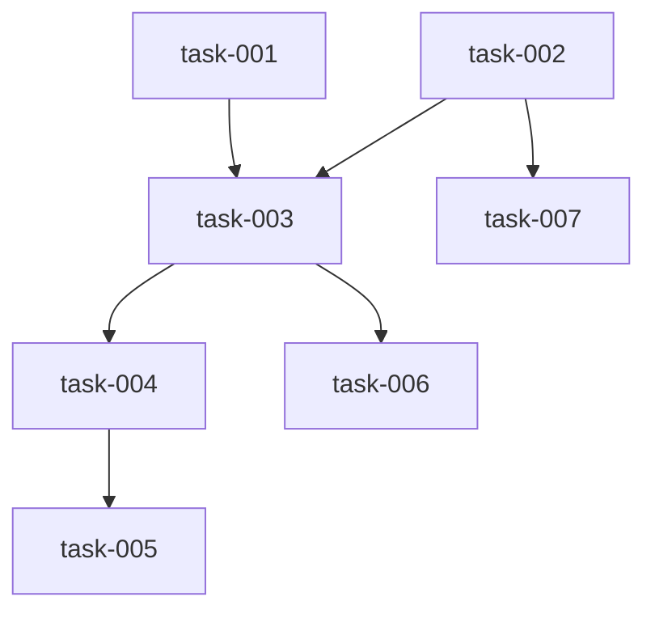

# Task Breakdown

## Task: task-001
- **Title**: Supabase project setup
- **Description**: Create Supabase project. Define `sessions` and `votes` tables with constraints, enable Realtime on both tables, and configure RLS policies (permissive public access for MVP).
- **Priority**: 1
- **Dependencies**: []
- **Estimated Complexity**: medium
- **Agent**: coder
- **Parallelizable**: no
- **Handoff Notes**: Use UUID session IDs; add unique constraint on (`session_id`, `participant_id`).
- **Verification Notes**: SQL migrations apply cleanly; Realtime is enabled for both tables.

## Task: task-002
- **Title**: Frontend scaffold (Vercel static)
- **Description**: Create static frontend with `index.html`, `app.js`, and `styles.css`. Add SPA routing (Vercel rewrite) so `/s/:id` loads the app. Configure Supabase client via `config.json` (local) or `/api/config` (Vercel env).
- **Priority**: 1
- **Dependencies**: []
- **Estimated Complexity**: low
- **Agent**: coder
- **Parallelizable**: yes
- **Handoff Notes**: Use `@supabase/supabase-js` ESM via CDN. Config comes from `config.json` (local) or `/api/config` (Vercel env).
- **Verification Notes**: App loads on `/` and `/s/:id` locally and on Vercel.

## Task: task-003
- **Title**: Session create + join flow
- **Description**: Implement create-session action: generate session ID, insert into `sessions`, redirect to `/s/:id`. Implement join flow: enter name, connect to Realtime channel with Presence metadata.
- **Priority**: 1
- **Dependencies**: [task-001, task-002]
- **Estimated Complexity**: medium
- **Agent**: coder
- **Parallelizable**: no
- **Handoff Notes**: Store a `participant_id` in `localStorage` for presence and votes.
- **Verification Notes**: Two browsers can join the same link and see each other in the participant list.

## Task: task-004
- **Title**: Realtime sync for votes + session state
- **Description**: Subscribe to `sessions` row and `votes` table for the current session. Update UI in real time when votes or reveal state change.
- **Priority**: 2
- **Dependencies**: [task-003]
- **Estimated Complexity**: medium
- **Agent**: coder
- **Parallelizable**: no
- **Handoff Notes**: When `revealed=false`, show only who has voted; when `revealed=true`, show values + average.
- **Verification Notes**: Reveal in one tab updates all tabs instantly; votes update live.

## Task: task-005
- **Title**: Voting actions (vote/reveal/reset)
- **Description**: Implement vote upsert, reveal toggle, and reset (delete votes + set `revealed=false`). Update `last_activity_at` on any action.
- **Priority**: 2
- **Dependencies**: [task-004]
- **Estimated Complexity**: medium
- **Agent**: coder
- **Parallelizable**: no
- **Handoff Notes**: Average excludes `?` and `coffee`. Show `N/A` if no numeric votes.
- **Verification Notes**: Average is correct; reset clears votes for all.

## Task: task-006
- **Title**: Session expiry handling
- **Description**: On join and any action, check `last_activity_at`. If inactive for > 3 hours, show expired message and prevent voting/reveal until a new session is created.
- **Priority**: 3
- **Dependencies**: [task-003]
- **Estimated Complexity**: low
- **Agent**: coder
- **Parallelizable**: yes
- **Handoff Notes**: Implement a small helper `ensureActiveSession()` used before actions.
- **Verification Notes**: Expired session shows friendly state and blocks actions.

## Task: task-007
- **Title**: UI styling and polish
- **Description**: Add minimalist but pleasant design (typography, spacing, card styling, responsive layout).
- **Priority**: 3
- **Dependencies**: [task-002, task-003]
- **Estimated Complexity**: low
- **Agent**: coder
- **Parallelizable**: yes
- **Handoff Notes**: Keep it light and readable; avoid visual noise.
- **Verification Notes**: UI is clear on desktop and mobile; cards are easy to tap.

## Dependency Graph

